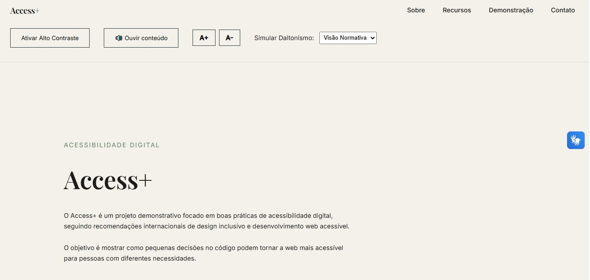

# Access+

Para abrir acesse:
https://erifrancelino.github.io/access-plus/

# Objetivo do Projeto

O **Access+** foi desenvolvido para demonstrar práticas de desenvolvimento front-end com ênfase em:

- acessibilidade digital
- estrutura semântica
- identidade editorial

O projeto tem caráter **educativo** e serve como **exemplo técnico de portfólio acessível**.

---

# Público-Alvo

## Primário

- Estudantes de tecnologia (ADS, Ciência da Computação, Engenharia de Software)
- Desenvolvedores front-end e back-end
- Recrutadores e empresas de tecnologia e design

## Secundário

- Educadores
- Pessoas interessadas em acessibilidade digital
- Desenvolvedores iniciantes

---

# Metas Técnicas

O projeto busca implementar:

- HTML semântico corretamente (`header`, `nav`, `main`, `section`, `footer`)
- práticas alinhadas às **diretrizes WCAG**
- uso estratégico de **atributos ARIA**
- **navegação funcional via teclado**
- **botão de alto contraste com JavaScript**
- **controle de aumento de fonte**
- **simulação de daltonismo**
- contraste mínimo adequado entre texto e fundo
- organização do desenvolvimento em **Sprints**
- versionamento do projeto no **GitHub**
- documentação técnica no **README**

---

# Identidade Visual e Acessibilidade

## Paleta de cores

- Fundo principal: `#F4F1EA` (bege editorial)
- Texto principal: `#1C1C1C` (quase preto)
- Cor institucional: `#7A9E7E` (verde acinzentado)
- Destaque editorial: `#C67C8E` (rosa queimado suave)
- Cor estrutural profunda: `#2F3A3F`

### Modo alto contraste

- fundo preto `#000`
- texto branco `#FFF`
- adaptação automática de botões e bordas

---

# Tipografia

Títulos  
Playfair Display (serif editorial)

Texto corrido  
Inter / Segoe UI (sans-serif moderna)

Configuração tipográfica:

- Corpo do texto: **16px**
- Line-height: **1.7**
- H1: **3.5rem**
- H2: **2rem**

---

# Layout e Espaçamento

- Line-height: 1.7
- Margem inferior consistente em parágrafos
- Seções com **6rem de espaçamento vertical**
- Layout **arejado e escaneável**

---

# Botões e Links

- Links sem sublinhado padrão
- Animação discreta no hover
- Foco acessível com **outline visível**
- Botões minimalistas com borda sólida
- Hover invertido
- Compatível com **modo alto contraste**

---

# Funcionalidades de Acessibilidade

O projeto inclui:

- Navegação por teclado
- Skip link ("Pular para conteúdo")
- Botão de alto contraste
- Simulação de daltonismo
- Ajuste de tamanho de fonte
- Feedback para leitores de tela
- Estrutura semântica compatível com WCAG

